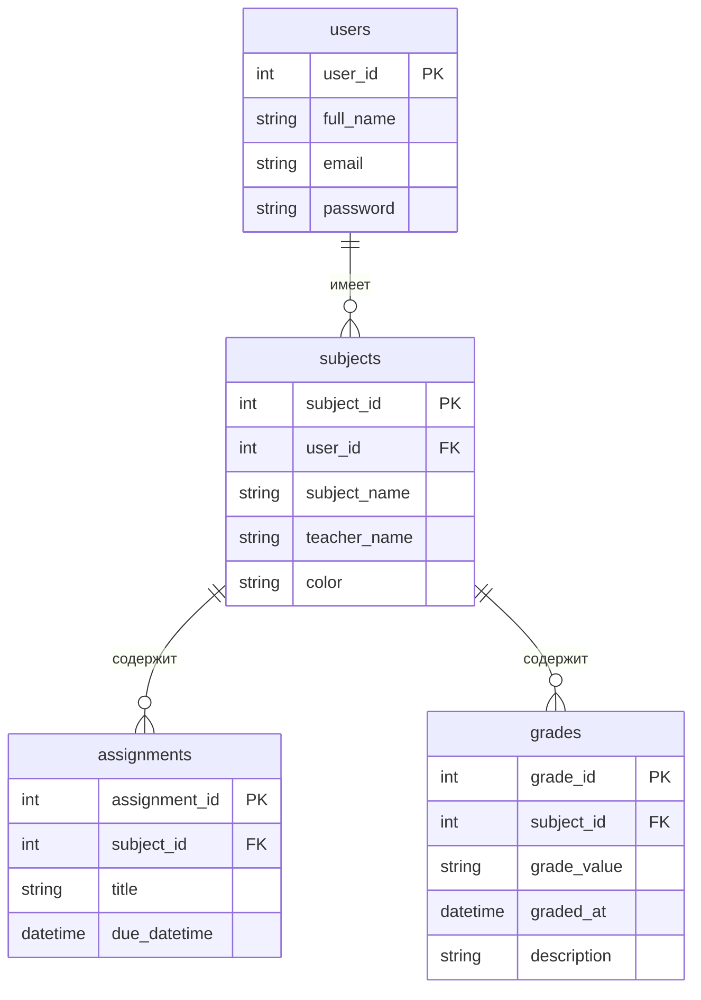

# Техническое задание
## Веб-трекер успеваемости и долгов

---

### 1. Общие положения

#### 1.1. Наименование проекта
Веб-трекер успеваемости и долгов

#### 1.2. Назначение и цели разработки
Инструмент для визуализации оценок и отслеживания дедлайнов по учебе.

#### 1.3. Суть проекта
Веб-приложение для студентов и школьников, позволяющее отслеживать успеваемость по предметам, управлять заданиями и дедлайнами, анализировать прогресс.

#### 1.4. Основание для разработки
- Школьники: базовый функционал «Дневник.ру» не позволяет отслеживать дедлайны по домашним работам/проектам и прогресс. Трекер дает возможность самостоятельно ставить дедлайны и иметь полную аналитику по оценкам.
- Студенты УРФУ: баллы по предметам выставляются поздно, студенту самому приходится отслеживать успеваемость. Трекер позволяет загружать оценки, анализировать статистику, ставить дедлайны по задачам.

#### 1.5. Сроки разработки
- Общая длительность: 2 недели
- Непосредственно на программирование: 1 рабочая неделя

#### 1.6. Планируемые этапы разработки
1. Проектирование БД и API
2. Разработка бэкенда (CRUD предметов, оценок, заданий)
3. Разработка фронтенда (интерфейс, связь с API)
4. Интеграция календаря и аналитики
5. Тестирование и сдача прототипа

#### 1.7. Глоссарий

| Термин | Определение |
|--------|-------------|
| Предмет | Учебная дисциплина (математика, физика, программирование и т.д.) |
| Задание | Контрольная точка/домашнее задание/лабораторная работа с дедлайном |
| Дедлайн | Крайний срок сдачи задания |
| Оценка | Результат выполненного задания или экзамена |
| Средний балл | Среднее арифметическое всех оценок по предмету |
| Календарь | Визуальное отображение дедлайнов по дням месяца |
| CRUD | Create, Read, Update, Delete (создание, чтение, обновление, удаление) |

#### 1.8. Порядок приемки и сдачи работы
1. Демонстрация работоспособности CRUD-операций для предметов
2. Демонстрация работоспособности CRUD-операций для оценок
3. Демонстрация работоспособности CRUD-операций для заданий
4. Проверка автоматического подсчета среднего балла
5. Проверка работы календаря с отображением дедлайнов
6. Проверка боковой панели (навигация, смена темы, выход)
7. Код размещен в репозитории, есть инструкция по запуску


### 2. Функциональные требования

#### 2.1. Обязательные функции

**2.1.1. Регистрация и авторизация**

| Поле | Описание |
|------|----------|
| **Входные данные** | Полное имя (строка, 2-100 символов), email (формат email), пароль (мин. 8 символов, латиница) |
| **Бизнес-логика** | Валидация всех полей, проверка на существующего пользователя, хэширование пароля (bcrypt), выдача JWT-токена при успешном входе |
| **Выходные данные** | Токен доступа, данные пользователя (id, имя, email), сообщения об ошибках валидации |

**2.1.2. Боковая панель навигации (обязательная для всех страниц)**

| Поле | Описание |
|------|----------|
| **Входные данные** | Текущая страница, текущая тема |
| **Бизнес-логика** | Панель фиксирована слева, видна на всех страницах для авторизованного пользователя, активная вкладка подсвечивается. Состав: логотип/название проекта, кнопка "Предметы", кнопка "Календарь", кнопка смены темы (светлая/тёмная), кнопка "Выход". Смена темы сохраняется в localStorage |
| **Выходные данные** | Переключение между страницами, смена темы, выход из аккаунта |

**2.1.3. Страница предметов (таблица)**

| Поле | Описание |
|------|----------|
| **Входные данные** | Список предметов текущего пользователя |
| **Бизнес-логика** | Загрузка всех предметов пользователя, клик по строке → переход на страницу деталей предмета (с заданиями и оценками). Таблица со столбцами: Название, Преподаватель, Количество заданий, Количество оценок, Средний балл, Цвет |
| **Выходные данные** | Таблица с данными, кнопки "Создать предмет" и "Редактировать/Удалить" |

**2.1.4. Создание предмета**

| Поле | Описание |
|------|----------|
| **Входные данные** | Название (строка, 1-100 символов), преподаватель (строка, 0-100 символов), цвет (HEX-код, например #FF5733) |
| **Бизнес-логика** | Валидация полей, привязка к текущему пользователю, цвет может быть выбран из палитры или сгенерирован автоматически |
| **Выходные данные** | Созданный предмет, обновленная таблица |

**2.1.5. Редактирование предмета**

| Поле | Описание |
|------|----------|
| **Входные данные** | Те же поля, что и у создания (название, преподаватель, цвет) |
| **Бизнес-логика** | Загрузка текущих данных предмета в форму, валидация, сохранение изменений |
| **Выходные данные** | Обновленный предмет, обновленная таблица |

**2.1.6. Удаление предмета**

| Поле | Описание |
|------|----------|
| **Входные данные** | ID предмета |
| **Бизнес-логика** | Подтверждение удаления (модальное окно), каскадное удаление всех связанных заданий и оценок |
| **Выходные данные** | Предмет удален, обновленная таблица |

**2.1.7. Страница деталей предмета (клик по строке предмета)**

| Поле | Описание |
|------|----------|
| **Входные данные** | ID предмета |
| **Бизнес-логика** | Загрузка всех заданий и оценок выбранного предмета. Отображение информации о предмете (название, преподаватель, цвет, средний балл). Два раздела: "Задания" (таблица: Название, Дата и время дедлайна) и "Оценки" (таблица: Значение, Описание, Дата получения) |
| **Выходные данные** | Детальная страница с двумя таблицами |

**2.1.8. Создание задания (в рамках предмета)**

| Поле | Описание |
|------|----------|
| **Входные данные** | Название (строка, 1-100 символов), дата и время дедлайна (формат YYYY-MM-DD HH:MM), привязка к предмету |
| **Бизнес-логика** | Валидация полей, дата дедлайна не может быть в прошлом (опционально) |
| **Выходные данные** | Созданное задание, обновленная таблица заданий |

**2.1.9. Редактирование задания**

| Поле | Описание |
|------|----------|
| **Входные данные** | Те же поля, что и у создания (название, дата и время дедлайна) |
| **Бизнес-логика** | Загрузка текущих данных задания в форму, валидация, сохранение изменений |
| **Выходные данные** | Обновленное задание, обновленная таблица заданий |

**2.1.10. Удаление задания**

| Поле | Описание |
|------|----------|
| **Входные данные** | ID задания |
| **Бизнес-логика** | Подтверждение удаления (модальное окно) |
| **Выходные данные** | Задание удалено, обновленная таблица заданий |

**2.1.11. Создание оценки (в рамках предмета)**

| Поле | Описание |
|------|----------|
| **Входные данные** | Значение (строка, например "5", "4.5", "A", "80"), описание (строка, 0-200 символов), дата получения (формат YYYY-MM-DD), привязка к предмету |
| **Бизнес-логика** | Валидация полей, автоматический пересчет среднего балла предмета (если значение числовое) |
| **Выходные данные** | Созданная оценка, обновленная таблица оценок, обновленный средний балл |

**2.1.12. Редактирование оценки**

| Поле | Описание |
|------|----------|
| **Входные данные** | Те же поля, что и у создания (значение, описание, дата получения) |
| **Бизнес-логика** | Загрузка текущих данных оценки в форму, валидация, сохранение изменений, автоматический пересчет среднего балла предмета |
| **Выходные данные** | Обновленная оценка, обновленная таблица оценок, обновленный средний балл |

**2.1.13. Удаление оценки**

| Поле | Описание |
|------|----------|
| **Входные данные** | ID оценки |
| **Бизнес-логика** | Подтверждение удаления (модальное окно), автоматический пересчет среднего балла предмета |
| **Выходные данные** | Оценка удалена, обновленная таблица оценок, обновленный средний балл |

#### 2.2. Необязательные функции

**2.2.1. Вкладка "Календарь"**

| Поле | Описание |
|------|----------|
| **Входные данные** | Список заданий пользователя, список предметов с цветами |
| **Бизнес-логика** | Календарь с датами текущего месяца, подсветка текущей даты. Каждое задание (дедлайн) отображается в ячейке календаря с названием и цветом предмета. Навигация по месяцам (вперед/назад). Клик по заданию → переход к деталям предмета |
| **Выходные данные** | Календарная сетка с заданиями-дедлайнами |

**2.2.2. Создание задания через календарь**

| Поле | Описание |
|------|----------|
| **Входные данные** | Предмет из списка (выпадающий список), название задания (строка, 1-100 символов), дата и время дедлайна (формат YYYY-MM-DD HH:MM) |
| **Бизнес-логика** | Открытие мини-окна при клике на кнопку "+" или на ячейку календаря, выбор предмета, валидация полей, привязка к предмету |
| **Выходные данные** | Созданное задание, обновленный календарь, обновленная таблица заданий |

**2.2.3. Редактирование задания через календарь**

| Поле | Описание |
|------|----------|
| **Входные данные** | Те же поля, что и у создания (предмет, название, дата и время дедлайна) |
| **Бизнес-логика** | Открытие мини-окна с заполненными данными, валидация, сохранение изменений |
| **Выходные данные** | Обновленное задание, обновленный календарь, обновленная таблица заданий |

**2.2.4. Удаление задания через календарь**

| Поле | Описание |
|------|----------|
| **Входные данные** | ID задания |
| **Бизнес-логика** | Подтверждение удаления (модальное окно) |
| **Выходные данные** | Задание удалено, обновленный календарь, обновленная таблица заданий |


### 3. Макет с отражением функций (Figma)

3.1. Боковая панель навигации (логотип, кнопки "Предметы", "Календарь", смена темы, "Выход")
3.2. Регистрация/авторизация
3.3. Страница предметов (таблица с колонками: Название, Преподаватель, Количество заданий, Количество оценок, Средний балл, Цвет)
3.4. Создание/редактирование предмета (модальное окно: название, преподаватель, выбор цвета)
3.5. Страница деталей предмета (информация о предмете + два раздела: Задания и Оценки)
3.6. Создание/редактирование задания (модальное окно: название, дата и время дедлайна)
3.7. Создание/редактирование оценки (модальное окно: значение, описание, дата получения)
3.8. Страница календаря (календарная сетка с заданиями-дедлайнами, подсвеченными цветом предмета)
3.9. Создание/редактирование задания через календарь (мини-окно)
3.10. Состояния интерфейса (Loading / Error / Empty)


### 4. Стек технологий

#### 4.1. Фронтенд
| Компонент | Технология |
|-----------|------------|
| Язык программирования | TypeScript |
| Фреймворк | React |
| Стейт-менеджмент | Zustand / Redux Toolkit |
| Стилизация | CSS Modules / Styled Components / Tailwind |
| HTTP-клиент | Axios |
| Маршрутизация | React Router |
| Календарь | date-fns / dayjs |

#### 4.2. Бэкенд (3 варианта на выбор)

**4.2.1. Вариант №1: Python FastAPI**

| Компонент | Технология |
|-----------|------------|
| Язык программирования | Python 3.10+ |
| Веб-фреймворк | FastAPI |
| ORM | SQLAlchemy |
| Миграции | Alembic |
| Валидация | Pydantic |
| Авторизация | OAuth2 + JWT (PyJWT), passlib (bcrypt) |
| Контейнеризация | Docker + Docker Compose |

**4.2.2. Вариант №2: Go Gin**

| Компонент | Технология |
|-----------|------------|
| Язык программирования | Golang 1.21+ |
| Веб-фреймворк | Gin |
| ORM | GORM |
| Миграции | GORM AutoMigrate / golang-migrate |
| Валидация | go-playground/validator |
| Документация API | swaggo |
| Авторизация | golang-jwt/jwt, crypto/bcrypt |
| Контейнеризация | Multi-stage Docker |

**4.2.3. Вариант №3: TypeScript Node.js**

| Компонент | Технология |
|-----------|------------|
| Язык программирования | TypeScript 5.0+ |
| Веб-фреймворк | Fastify / Express |
| ORM | Prisma |
| Миграции | prisma migrate |
| Валидация | Zod |
| Документация API | tsoa / Fastify плагины |
| Авторизация | jsonwebtoken, bcryptjs |
| Контейнеризация | Docker + Node-Alpine |

#### 4.3. База данных

| Компонент | Технология |
|-----------|------------|
| СУБД | PostgreSQL 14+ |
| Контейнеризация | Docker + Docker Compose |

**Схема базы данных:**



**Описание таблиц:**

| Таблица | Поле | Тип | Описание |
|---------|------|-----|----------|
| **users** | user_id | int PK | Идентификатор пользователя |
| | full_name | string | Полное имя |
| | email | string | Email (уникальный) |
| | password | string | Хэш пароля (bcrypt) |
| **subjects** | subject_id | int PK | Идентификатор предмета |
| | user_id | int FK | Владелец предмета |
| | subject_name | string | Название предмета |
| | teacher_name | string | ФИО преподавателя |
| | color | string | HEX-код цвета (#FF5733) |
| **assignments** | assignment_id | int PK | Идентификатор задания |
| | subject_id | int FK | Родительский предмет |
| | title | string | Название задания |
| | due_datetime | datetime | Дата и время дедлайна |
| **grades** | grade_id | int PK | Идентификатор оценки |
| | subject_id | int FK | Родительский предмет |
| | grade_value | string | Значение оценки (5, 4.5, A, 80) |
| | graded_at | datetime | Дата получения |
| | description | string | Описание/комментарий |

#### 4.4. Архитектурное расширение (внедрение «1С»)

**4.4.1. Модуль «1С»**
- Платформа: «1С:Предприятие» под Linux
- Развертывание: изолированный контейнер в Docker Compose
- Взаимодействие: основной бэкенд выступает прокси-слоем для запросов пользователей, «1С» работает как внутренний микросервис

**4.4.2. Варианты использования «1С»**

**Вариант А. 1С как Бэк-офис, CRM и Админ-панель**
- Назначение: готовая административная панель «из коробки»
- Функции: управление пользователями, обработка тикетов, модерация контента, ведение логов
- Интерфейс: тонкий или веб-клиент 1С для администраторов и модераторов

**Вариант Б. 1С как вычислительное ядро (Rule Engine)**
- Назначение: сложные расчеты успеваемости
- Функции: расчет средневзвешенных оценок с учетом коэффициентов, пересчет баллов по разным шкалам (5-балльная, 12-балльная, 100-балльная)
- Взаимодействие: бэкенд шлет массив оценок → 1С проводит расчеты → возвращает готовый результат

**Вариант В. 1С как микросервис генерации отчетности (PDF/Excel)**
- Назначение: генерация сложных структурированных отчетов
- Функции: формирование PDF-отчетов об успеваемости за семестр, Excel-таблиц для печати
- Инструмент: СКД (Система компоновки данных) и табличный документ 1С
- Взаимодействие: бэкенд шлет сырые данные → 1С компонует отчет → конвертирует в PDF/XLSX → возвращает файл

#### 4.5. Технологическая совместимость

| Компонент | Требование |
|-----------|------------|
| Браузеры | Chrome 90+, Firefox 88+, Safari 14+, Edge 90+ |
| ОС сервера | Ubuntu 20.04 / 22.04 |
| СУБД | PostgreSQL 14+ |
| Контейнеризация | Docker 20.10+, Docker Compose 2.0+ |
| Python | 3.10+ (для варианта 4.2.1) |
| Golang | 1.21+ (для варианта 4.2.2) |
| Node.js | 18+ (для варианта 4.2.3) |
| TypeScript | 5.0+ (для варианта 4.2.3) |


### 5. Нефункциональные требования

#### 5.1. Производительность (SLA)

| Параметр | Требование |
|----------|------------|
| Время отклика API | 95% запросов < 300 мс |
| Количество одновременных пользователей | Не менее 100 |
| Время загрузки страницы предметов | < 2 секунд |
| Время загрузки страницы деталей предмета | < 1.5 секунд |
| Время переключения между вкладками | < 500 мс |

#### 5.2. Надежность

| Параметр | Требование |
|----------|------------|
| Время восстановления после сбоя (RTO) | < 30 минут |
| Точка восстановления (RPO) | < 1 час |
| Логирование ошибок | Фиксируются: timestamp, пользователь, тип ошибки, стек вызовов |
| Аудит действий | Фиксируются: входы в систему, создание/изменение/удаление предметов, заданий и оценок |

#### 5.3. Безопасность

| Параметр | Требование |
|----------|------------|
| Хранение паролей | bcrypt (хэширование) |
| Передача данных | Только по HTTPS |
| Авторизация | JWT-токены (expires_in: 86400 секунд) |
| Защита от SQL-инъекций | Через ORM |
| Защита от XSS и CSRF | Обязательна |
| Разграничение доступа | Пользователь видит и редактирует только свои данные |
| Сохранение темы | В localStorage |


### 6. Особенности реализации

#### 6.1. Критерии выбора оптимального стека

| Критерий | Рекомендуемый стек | Обоснование |
|----------|-------------------|-------------|
| Команда имеет опыт работы с Python | Вариант №1 (Python FastAPI) | Встроенный Swagger «из коробки» позволяет фронтендерам тестировать запросы без ручного написания документации |
| Команда владеет JavaScript/TypeScript и планирует писать фронтенд на React | Вариант №3 (Node.js + TS) | Единый язык программирования на клиенте и сервере ускоряет коммуникацию в команде. Prisma сводит работу с БД к минимуму |
| Ограничены ресурсы хостинга или требуется высокая скорость работы API | Вариант №2 (Go Gin) | Go демонстрирует высокую производительность и низкий расход оперативной памяти, компилируясь в независимый бинарный файл |
| Необходима готовая CRM-система, сложные расчеты или генерация отчетности | Доп. модуль «1С» | Платформа 1С берет на себя тяжелую логику, разгружая основной бэкенд |

#### 6.2. Таблица соответствия критериев и стеков

| Стек | Прототипирование | Производительность | Единый язык с фронтом | Сложные расчеты | Отчетность | Админка |
|------|:---:|:---:|:---:|:---:|:---:|:---:|
| Python FastAPI | ✅ | ⚠️ | ❌ | ⚠️ | ⚠️ | ⚠️ |
| Go Gin | ⚠️ | ✅ | ❌ | ⚠️ | ⚠️ | ⚠️ |
| Node.js + TS | ✅ | ⚠️ | ✅ | ⚠️ | ⚠️ | ⚠️ |
| + Модуль «1С» | ❌ | ⚠️ | ❌ | ✅ | ✅ | ✅ |

#### 6.3. Обоснование выбора
- Выбор основного стека зависит от состава команды и ее ключевых компетенций
- Для быстрого прототипирования и удобной документации API → Python FastAPI
- Для высокой производительности и экономии ресурсов → Go Gin
- Для унификации стека (фронт + бэк на JS/TS) → Node.js + TypeScript
- Модуль «1С» подключается опционально при необходимости сложных расчетов, отчетности или готовой админ-панели

#### 6.4. Взаимодействие с модулем «1С»
- Основной бэкенд выступает прокси-слоем для запросов пользователей
- Обеспечивает минимальный пинг и быструю отрисовку интерфейса
- Транслирует во внутреннюю базу 1С административные события
- Расчет итоговых показателей делегируется 1С при выборе Варианта Б
- Генерация PDF/Excel отчетов делегируется 1С при выборе Варианта В

#### 6.5. План миграции данных (при интеграции с внешними системами)

| Параметр | Описание |
|----------|----------|
| Поддерживаемые источники | Дневник.ру, БРС УрФУ |
| Формат выгружаемых данных | JSON / CSV |
| Сопоставление полей | Маппинг полей внешней системы и внутренней БД |
| Обработка дубликатов | Обновление существующих записей |
| Обработка ошибок | Логирование неудачных записей с указанием причины |
| Периодичность синхронизации | По запросу пользователя (ручной импорт) |


### 7. Примерная структура проекта для стандартного варианта

#### 7.1. Общая структура

```
academic-tracker/
├── backend/                 # Бэкенд (FastAPI / Gin / Node.js)
├── frontend/                # Фронтенд (React)
├── docker-compose.yml       # Оркестрация контейнеров
├── .env.example             # Шаблон переменных окружения
└── README.md               # Инструкция по запуску
```

#### 7.2. Структура фронтенда (React)

```
frontend/
├── public/                  # Статика
├── src/
│   ├── api/                 # Клиент для запросов к бэкенду
│   │   ├── client.ts        # Axios-инстанс с интерцепторами
│   │   ├── auth.ts          # Эндпоинты авторизации
│   │   ├── subjects.ts      # Эндпоинты предметов
│   │   ├── assignments.ts   # Эндпоинты заданий
│   │   └── grades.ts        # Эндпоинты оценок
│   ├── components/          # UI-компоненты
│   │   ├── layouts/         # Шапка, сайдбар
│   │   │   ├── Sidebar.tsx
│   │   │   └── Layout.tsx
│   │   ├── auth/            # Страницы входа/регистрации
│   │   │   ├── Login.tsx
│   │   │   └── Register.tsx
│   │   ├── subjects/        # Таблица предметов, создание/редактирование
│   │   │   ├── SubjectTable.tsx
│   │   │   ├── SubjectForm.tsx
│   │   │   └── SubjectDetail.tsx
│   │   ├── assignments/     # Создание/редактирование задания
│   │   │   ├── AssignmentForm.tsx
│   │   │   └── AssignmentList.tsx
│   │   ├── grades/          # Создание/редактирование оценки
│   │   │   ├── GradeForm.tsx
│   │   │   └── GradeList.tsx
│   │   ├── calendar/        # Календарь
│   │   │   ├── Calendar.tsx
│   │   │   └── CalendarEvent.tsx
│   │   └── common/          # Общие компоненты
│   │       ├── Modal.tsx
│   │       ├── Button.tsx
│   │       └── Loader.tsx
│   ├── hooks/               # Кастомные React-хуки
│   │   ├── useAuth.ts
│   │   └── useTheme.ts
│   ├── store/               # Zustand / Redux (управление состоянием)
│   │   ├── authStore.ts
│   │   └── themeStore.ts
│   ├── types/               # TypeScript-типы
│   │   ├── user.ts
│   │   ├── subject.ts
│   │   ├── assignment.ts
│   │   └── grade.ts
│   ├── utils/               # Утилиты
│   │   ├── validators.ts    # Валидация форм
│   │   ├── formatters.ts    # Форматирование дат, чисел
│   │   └── theme.ts         # Работа с темой
│   ├── App.tsx
│   ├── main.tsx
│   └── index.css
├── package.json
├── tsconfig.json
└── vite.config.ts
```

#### 7.3. Структура бэкенда (Python FastAPI — пример)

```
backend/
├── src/
│   ├── main.py              # Точка входа FastAPI
│   ├── core/                # Конфигурация
│   │   ├── config.py        # Настройки приложения
│   │   ├── security.py      # JWT, хэширование
│   │   └── database.py      # Подключение к БД
│   ├── models/              # SQLAlchemy модели
│   │   ├── user.py
│   │   ├── subject.py
│   │   ├── assignment.py
│   │   └── grade.py
│   ├── schemas/             # Pydantic схемы (вход/выход)
│   │   ├── auth.py
│   │   ├── subject.py
│   │   ├── assignment.py
│   │   └── grade.py
│   ├── crud/                # Операции с БД (CRUD)
│   │   ├── subject.py
│   │   ├── assignment.py
│   │   └── grade.py
│   ├── api/                 # Роутеры (эндпоинты)
│   │   ├── auth.py
│   │   ├── subjects.py
│   │   ├── assignments.py
│   │   ├── grades.py
│   │   └── calendar.py      # Календарь и задания
│   └── utils/               # Утилиты
│       └── validators.py
├── migrations/              # Alembic миграции
├── Dockerfile
├── requirements.txt
└── .env
```


### 8. Приложения

#### 8.1. Схема базы данных (ER-диаграмма)

```
┌─────────────────┐
│      users      │
├─────────────────┤
│ user_id (PK)    │
│ full_name       │
│ email           │
│ password        │
└────────┬────────┘
         │ 1
         │
         │ N
┌────────▼────────┐
│    subjects     │
├─────────────────┤
│ subject_id (PK) │
│ user_id (FK)    │
│ subject_name    │
│ teacher_name    │
│ color           │
└────────┬────────┘
         │ 1
         ├──────────────────┐
         │                  │
         │ N                │ N
┌────────▼────────┐ ┌──────▼───────┐
│   assignments   │ │    grades    │
├─────────────────┤ ├──────────────┤
│ assignment_id   │ │ grade_id     │
│ subject_id (FK) │ │ subject_id   │
│ title           │ │ grade_value  │
│ due_datetime    │ │ graded_at    │
└─────────────────┘ │ description  │
                    └──────────────┘
```

**Связи:**
- `users` → `subjects`: 1:N (один пользователь имеет много предметов)
- `subjects` → `assignments`: 1:N (один предмет содержит много заданий)
- `subjects` → `grades`: 1:N (один предмет содержит много оценок)

#### 8.2. Макеты интерфейса (Figma)
- Ссылка на макет: [вставить ссылку]
- Экраны:
  - Регистрация
  - Авторизация
  - Боковая панель
  - Страница предметов (таблица)
  - Создание/редактирование предмета
  - Страница деталей предмета (задания + оценки)
  - Создание/редактирование задания
  - Создание/редактирование оценки
  - Календарь

#### 8.3. Скриншоты экранов
- [вставить скриншоты]

#### 8.4. Спецификация API (Swagger/OpenAPI)
- Формат: OpenAPI 3.0.3
- Доступна по адресу: `/docs` (FastAPI) или `/swagger` (Go/Node.js)
- Включает все эндпоинты:
  - Аутентификация (регистрация, логин, выход, восстановление пароля)
  - Пользователи (профиль, обновление)
  - Предметы (CRUD)
  - Задания (CRUD)
  - Оценки (CRUD)
  - Календарь (месяц, лента времени)
  - Интеграция (синхронизация с внешними системами)

---

**ТЗ готово к использованию.**
